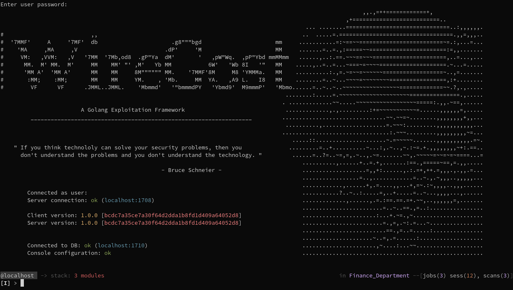

#                           
WireGost - Implant & Post-Exploitation Framework
 
______

## Overview

Wiregost is currently developed in its version 1.0.0. It has gone through two major developments: a rewrite of Merlin, 
then of Sliver, each time with the aim of enhancing the console UI part, by providing either better context, commands or 
general interaction refreshments. Both projects (Merlin and Sliver) have laid foundations for the use of the Go language 
for implant development. Moreover, they have done so while remaining well self-contained, thanks in part to the nature of Go.

However, many strengths of the language and its ecosystem were not leveraged (network programming capacities combined 
with Go's type system, UI libraries, ORM engines, etc), and I found these projects could benefit from a larger share of the 
Go ecosystem, while retaining good operability and maintanability.

At the same time, the increasing set of RPC frameworks available in Go (some of them being almost transport-agnostic) 
ultimately called for an object/capacity model defined with Protobuf, so as to provide easy code generation for RPC frameworks, 
but also to promote cross-language implant/tool development. Therefore, Protobuf is one of the pillars of Wiregost, as 
explained in the [proto/ directory](https://github.com/maxlandon/wiregost/tree/v1.0.0/proto/).

The combination of Go as a language, as a rich library ecosystem providing various networking capabilities, cross-platform functionality 
and execution, is a solid ground for developing a powerful, robust, extensible, and maintainable post-exploitation framework.

## Architecture

Wiregost's architecture rests on several pillars, aims and technologies: 

- Protobuf for API definitions, PostgreSQL for storage, Go for runtime.
- Go for simplicity, modularity, robustness and maintainability. 
- Protobuf as a language-agnostic, per-version specification of Wiregost [capacities/objects](https://github.com/maxlandon/tree/v1.0.0/proto/)
- Networking libraries in Go are powerful and the ecosystem rich: Advanced trafic management system.
- Database as a dual gRPC/REST service, for exposure to other tools.
- Use of different RPC/transport stacks, per-implant.
- Robust and powerful Console UI.

## Codebase 

* `client/`         - Console client code
* `server/`         - C2 Server code
* `ghost/`          - Implants code
* `modules/`        - All modules available (implants, post, etc...)
* `proto/`          - Protobuf messages (all objects/services used in all of Wiregost server/implants/console)
* `db/`             - Database (as a service) code

You can find a more through description of the code base in the [wiki page](https://github.com/maxlandon/wiregost/wiki/Code-Structure),
or by browsing the repository: READMEs are available for pretty much all subpackages, explaining their role and contents.

## Install

Assuming two classes of persons:
- Users of the tool can download [ready-to-run binaries](https://github.com/maxlandon/wiregost/releases) for their platform.
- Developers can [install for development](https://github.com/maxlandon/wiregost/wiki/Development-Setup)

## Documentation

Documentation in Wiregost is available in several forms:
- On the [Wiki](https://github.com/maxlandon/wiregost/wiki) of this repository.
- README files, in all directories, explain the content and role of packages and source code.

## Inspiration Sources

#### Sliver
[Sliver](https://github.com/BishopFox/sliver) is a post-exploitation/implant framework written in Go. It is the most advanced 
framework written in Go at the moment. This project has emphasized communication and authentication security, as well as easy implant compilation.
Significant blocks of their code will be reused in Wiregost v1.0.0, for instance Certificate generation/validation code.

#### Merlin
[Merlin](https://github.com/Ne0nd0g/merlin) is also a post exploitation framework written in Go. It emphasizes on the use of HTTP/2 for C2
communications. It also includes a Javascript agent, post-exploitation modules (mostly in PowerShell) usable **a-la-metasploit**. Downsides are
only one server capability, and no multi-client capacity either.

#### All the others

Computer security is as large a subject as computers alone. It goes the same for the number of tools related to it.
I would gladly pay for another 30 lives so I can discover them all, but I don't have God's SWIFT account number, and I'm
poor as hell. If, in the context of this project, some of them are worth so much that it would be criminal not to include 
them in this list, I will add them.

**The name:** I once felt upon a [video](https://www.youtube.com/watch?v=T8aXx3K_lKY) where the notorious 
[Kevin Mitnick](https://en.wikipedia.org/wiki/Kevin_Mitnick) is interviewed by an attractive journalist about the usual security 
and pricacy issues. Boring questions, boring answers (so boring that everyone comments on this instead of saying obsenities on 
the girl... very surprising), but he remembered me the name of his book: _"Ghost in the Wires"_. Just on point. Thank you Mr. Mitnick.

## Warmest Thanks

Thanks as warm as the sun are due to:

* The **Golang Project**.
* **BishopFox** for their Sliver framework, with which I've learned a lot.
* The **Merlin** project, with which I learned a lot too !

<!-- ## Capacities  -->

<!-- Most the features below are the same as [Sliver](https://github.com/BishopFox/sliver), as this project is mostly an enhancement of Sliver -->
<!-- and an attempt at merging [Merlin](https://github.com/Ne0nd0g/merlin) post-exploitation modules (altough with enhancements as well). -->
<!--  -->
<!-- ### Infrastructure -->
<!-- * [Secure C2](https://github.com/maxlandon/wiregost/wiki/Transport-Encryption) over mTLS, HTTP(S), and DNS -->
<!-- * Metasploit-like workspaces -->
<!-- * Mutiple consoles per user -->
<!-- * Multiple users per C2 Server  -->
<!-- * Let's Encrypt integration -->
<!-- * [DNS Canary](https://github.com/maxlandon/wiregost/wiki/DNS-Canaries) Blue Team Detection -->
<!--  -->
<!-- ### Console -->
<!-- * Per user & per workspace [module stacks](https://github.com/maxlandon/wiregost/wiki/Stack-Commands), used as "draft tables" -->
<!-- * Jobs management with various informations -->
<!-- * Seggregated workspace context (module stacks, etc) -->
<!-- * Transparent shell usage through the console -->
<!-- * Completions for Help, Commands, Options ,Values, local & remote filesystems -->
<!-- * Configurable prompts in the [main](https://github.com/maxlandon/wiregost/wiki/Console-Config) and [implant](https://github.com/maxlandon/wiregost/wiki/Implant-Config) menu, with many variables -->
<!-- * [Vim & Emacs input modes](https://github.com/maxlandon/wiregost/wiki/Core-Commands) -->
<!--  -->
<!-- ### Listeners -->
<!-- * Persistent Listeners (automatic spawn at server startup) -->
<!-- * Stagers & their serving listeners -->
<!--  -->
<!-- ### Implants -->
<!-- * [Multi architecture/OS implants](https://github.com/maxlandon/wiregost/wiki/Payload-Modules) -->
<!-- * Concurrent & Dynamic code generation -->
<!-- * Compile-time obfuscation -->
<!-- * Local and remote process injection -->
<!-- * Anti-forensics -->
<!-- * Windows process migration -->
<!-- * Windows user token manipulation -->
<!-- * In-memory .NET assembly execution -->
<!-- * Real-time filesystem completion (configurable) -->
<!--  -->
<!-- ### Modules -->
<!-- * Metasploit-like [Modules User Interface](https://github.com/maxlandon/wiregost/wiki/Module-Commands) -->
<!-- * Implant generation & listener spawn modules (both single and stager payloads/listeners) -->
<!-- * Post-exploitation modules from Merlin (rewrited) (*work in progress*) -->
<!-- * Easy interface and templates for [writing Post-exploitation modules](https://github.com/maxlandon/wiregost/wiki/Modules-Overview) -->
<!-- * Many methods for interacting with sessions and performing tasks on them (priv, proc, execution, injection, etc...) -->

<!-- **Routing**  -->

