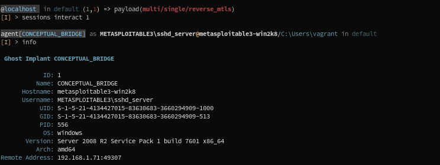

#                      
WireGost - Implant & Post-Exploitation Framework
 
______

<!--  -->

The grounds for the WireGost exploitation framework project are:
* **Go is syntactically dead simple** and has a C-like object-model: This will lower the number of abstraction-layers-caused headaches.
* Consequently, Go code is easily readable and maintainable. Go is strongly typed, which make Gophers winners on all fronts.
* Go **compiles itself cross-platform**: Code compiled on a Linux machine will run _on virtually any architecture and operating system_.
  The implications for payload efficiency are wide-ranging.
* Go standard library includes what is probably the most advanced networking stack at the moment. Again, the implications for both framework
  complexity and payload modularity are significant.

**The name:** I recently looked a [video](https://www.youtube.com/watch?v=T8aXx3K_lKY) where the notorious 
[Kevin Mitnick](https://en.wikipedia.org/wiki/Kevin_Mitnick) is interviewed by an attractive journalist about the usual security 
and pricacy issues. Boring questions, boring answers (so boring that everyone comments on this instead of saying obsenities on 
the girl... very surprising), but he remembered me the name of his book: _"Ghost in the Wires"_. Just on point. Thank you Mr. Mitnick.

______
## Features

Most the features below are the same as [Sliver](https://github.com/BishopFox/sliver), as this project is mostly an enhancement of Sliver
and an attempt at merging [Merlin](https://github.com/Ne0nd0g/merlin) post-exploitation modules (altough with enhancements as well).

### Infrastructure
* [Secure C2](https://github.com/maxlandon/wiregost/wiki/Transport-Encryption) over mTLS, HTTP(S), and DNS
* Metasploit-like workspaces
* Mutiple consoles per user
* Multiple users per C2 Server + seggregated workspace context (module stacks, etc)
* Let's Encrypt integration
* [DNS Canary](https://github.com/maxlandon/wiregost/wiki/DNS-Canaries) Blue Team Detection

### Implants
* Multi architecture/OS implants
* Concurrent & Dynamic code generation
* Compile-time obfuscation
* Local and remote process injection
* Anti-forensics
* Windows process migration
* Windows user token manipulation
* In-memory .NET assembly execution

### Modules
* Metasploit-like Modules User Interface
* Implant generation & listener spawn modules (both single and stager payloads/listeners)
* Post-exploitation modules from Merlin (rewrited) (*work in progress*)
* Easy interface and templates for [writing Post-exploitation modules](https://github.com/maxlandon/wiregost/wiki/Modules-Overview)

______
## Documentation 

The documentation for WireGost is available on the [Wiki](https://github.com/maxlandon/wiregost/wiki) of this repository.
You will find everything needed to install, setup and use Wiregost C2 Server and Console.

______
## Quick Codebase Structure Overview 

* `client/`         - Console client code
* `server/`         - C2 Server code
* `ghost/`          - Implants code
* `modules/`        - All modules available (implants, post, etc...)
* `protobuf/`       - Protobuf message (core of the capabilities of Wiregost)
* `data_service/`   - Data Service code

You can find a more through description of the code base in the [wiki page](https://github.com/maxlandon/wiregost/wiki/Code-Structure),
or by browsing the repository: READMEs are available for pretty much all subpackages, explaining their role and contents.

______
## Sub-Repository Tools

#### EffectiveCouscous
[Maltego](https://www.paterva.com/web7/buy/maltego-clients/maltego-ce.php) is not really a tool for computer exploitation. 
Maltego is a software that allows to graph various kinds of networks (computers, social, criminal, and many others), in a
versatile, flexible, automated and efficient way, . It can be used for any activity having an investigative character. 
And since computer security is the cute child of a chessboard, a magic labyrinth and an escape game, Maltego is your best friend.
[EffectiveCouscous](https://github.com/maxlandon/EffectiveCouscous) is an attempt at interfacing various security tools with Maltego.

Maltego will act as a GUI interface with visualization, inference and discovery capabilities. All data from WireGost will be used
by Maltego.

______
## Projects that have inspired/motivated/been outright copy-pasted

#### Sliver
[Sliver](https://github.com/BishopFox/sliver) is a post-exploitation/implant framework written in Go. It seems to be the most advanced 
framework written in Go at the moment. Therefore, most of WireGost codebase is exactly the same than Sliver. We then need to address
**a huge thanks** and **deep and sincere excuses** to the BishopFox team, because my code is mostly theirs, and I have shamelessly changed the "Slivers"
everywhere with "Ghost". (I have a good excuse, though: it was the most efficient way to force myself going everywhere in their code base.)
Thanks a lot, because I've learned a ton of things from it, and I'm really admirative of such tools, I would be totally unable to produce a iota
of it on my own. 

#### Merlin
[Merlin](https://github.com/Ne0nd0g/merlin) is also a post exploitation framework written in Go. It emphasizes on the use of HTTP/2 for C2
communications. It also includes a Javascript agent, post-exploitation modules (mostly in PowerShell) usable **a-la-metasploit**. Downsides are
only one server capability, and no multi-client capacity either.

#### All the others

Computer security is as large a subject as computers alone. It goes the same for the number of tools related to it.
I would gladly pay for another 30 lives so I can discover them all, but I don't have God's SWIFT account number, and again, I'm
poor as hell. If, in the context of this project, some of them are worth so much that it would be criminal not to include 
them in this list, I will add them.

______
## TO DO & ROADMAP

#### TO DO

**Console**
* Check codebase linting
* Add completers for:
    - All command options/filters in the implant menu
    - Filesystem completion in the implant menu
    - Fix the completion for help commands, depending on menu context
* Commands for:
    - Deleting generated ghost implants
    - Deleting profiles
    - Deleting users
* Less hacky option filters for many commands, and better command help for these
* Add/Rewrite help for:
    - Execute-Assembly command
    - Add examples to many command helps
* Config for implant working directory completions
* Config for MSF path, if installed from source and not with nightly installers (error with msfvenom)

**C2 Server**
* Persistent module stacks
* Persistent listeners
* Fix connect/disconnect detections from the server
* Add workspace/host settings to implant modules + implant registration
* Help for MSF listeners / eventually a separate module.
* Check all proc/priv/execute commands.
* Check why obfuscated implants cannot be generated at the same time without messing the namespace up

* Error handling/UI:
    - Make all errors in modules at the server level to go up to the console

**Modules**
* Add Merlin post-exploitation modules
* If possible, uniformize Options key:value pairs for console usage

**Documentation**
* Pages for:
    - Canaries commands
    - Websites commands
    - Ghosts commands
    - Implant config
    - Console troubleshooting
    - Priv Commands
    - Proc Commands
    - Execute Commands
    - Agent shell command
    - Post Modules

* Data Service:
    - Host Commands

______
## Warmest Thanks
* The **Golang Project**.
* **BishopFox** for their Sliver framework, with which I've learned a lot.
* The **Merlin** project, with which I learned a lot too !
