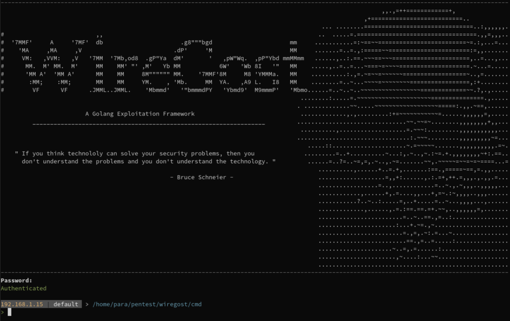

#                      
WireGost - Golang Exploitation Framework
 
______

The grounds for the WireGost exploitation framwework project are:
* **Go is syntactically dead simple** and has a simple C-like object-model: This will lower the number of abstraction-layers-caused headaches.
* Consequently, Go code is easily readable and maintainable. Go is strongly typed, which make Gophers winners on all fronts.
* Go **compiles itself cross-platform**: Code compiled on a Linux machine will run _on virtually any architecture and operating system_.
  The implications for payload efficiency are wide-ranging.
* Go standard library includes what is probably the most advanced networking stack at the moment. Again, the implications for both framework
  complexity and payload modularity are significant.

**The name:** I recently looked a [video](https://www.youtube.com/watch?v=T8aXx3K_lKY) where the notorious 
[Kevin Mitnick](https://en.wikipedia.org/wiki/Kevin_Mitnick) is interviewed by an attractive journalist about the usual security 
and pricacy issues. Boring questions, boring answers (so boring that everyone comments on this instead of saying obsenities on 
the girl... very surprising), but he remembered me the name of his book: _"Ghost in the Wires"_. Just on point. Thank you Mr. Mitnick.

______
## Table of Contents 

The documentation for WireGost is also available on the [Wiki](https://github.com/maxlandon/wiregost/wiki) of this repository.

### Overview
* [**General Architecture**](https://github.com/maxlandon/wiregost/wiki/General-Architecture)
* [**Code Structure**](https://github.com/maxlandon/wiregost/wiki/Code-Structure)
* [**Environment**](https://github.com/maxlandon/wiregost/wiki/Personal-Environment)

### Usage
* [**Installation**](https://github.com/maxlandon/wiregost/wiki/Installation)
* [**Base Usage**](https://github.com/maxlandon/wiregost/wiki/Base-Usage)
* [**Commands**](https://github.com/maxlandon/wiregost/wiki/Commands)
    * [Core](https://github.com/maxlandon/wiregost/wiki/Core-Commands)
    * [Help](https://github.com/maxlandon/wiregost/wiki/Help-Commands)
    * [Server](https://github.com/maxlandon/wiregost/wiki/Server-Commands)
    * [Log](https://github.com/maxlandon/wiregost/wiki/Log-Commands)
    * [Chat](https://github.com/maxlandon/wiregost/wiki/Chat-Commands)
    * [Workspace](https://github.com/maxlandon/wiregost/wiki/Workspace-Commands)
    * [Stack](https://github.com/maxlandon/wiregost/wiki/Stack-Commands)

### Other 
* [**Required Specs**](https://github.com/maxlandon/wiregost/wiki/Required-Specs)
* [**Ideas**](https://github.com/maxlandon/wiregost/wiki/Ideas)
* [**To Do**](https://github.com/maxlandon/wiregost/wiki/To-Do)

______
## Sub-Repository Tools

#### EffectiveCouscous

#### Maltego
[Maltego](https://www.paterva.com/web7/buy/maltego-clients/maltego-ce.php) is not really a tool for computer exploitation. 
Maltego is a software that allows to graph various kinds of networks (computers, social, criminal, and many others), in a
versatile, flexible, automated and efficient way, . It can be used for any activity having an investigative character. 
And since computer security is the cute child of a chessboard, a magic labyrinth and an escape game, Maltego is your best friend.

Maltego will act as a GUI interface with visualization, inference and discovery capabilities. All data from WireGost will be used
by Maltego.

## Projects that have insipired/motivated/been outright copy-pasted

#### Sliver
[Sliver](https://github.com/BishopFox/sliver) is an post-exploitation/implant framework written in Go. It seems to be the most advanced 
framework written in Go at the moment. Therefore, most of WireGost codebase is exactly the same than Sliver.

#### Merlin
[Merlin](https://github.com/Ne0nd0g/merlin) is also a post exploitation framework written in Go. It emphasizes on the use of HTTP/2 for C2
communications. It also includes a Javascript agent, post-exploitation modules (mostly in PowerShell) usable **a-la-metasploit**. Downsides are
only one server capability, and no multi-client capacity either.

#### All the others

Computer security is as large a subject as computers alone. It goes the same for the number of tools related to it.
I would gladly pay for another 30 lives so I can discover them all, but I don't have God's SWIFT account number, and again, I'm
poor as hell. If, in the context of this project, some of them are worth so much that it would be criminal not to include 
them in this list, I will add them.

______

## The Requirements

[This is the list of requirements for WireGost](https://github.com/maxlandon/wiregost/wiki/Requirements). 
This list will be updated as ideas appear, appear to be good, or appear to be bad.

______

## Warmest Thanks
* The **Golang Project**.
* **BishopFox** for their Sliver framework, with which I've learned a lot.
